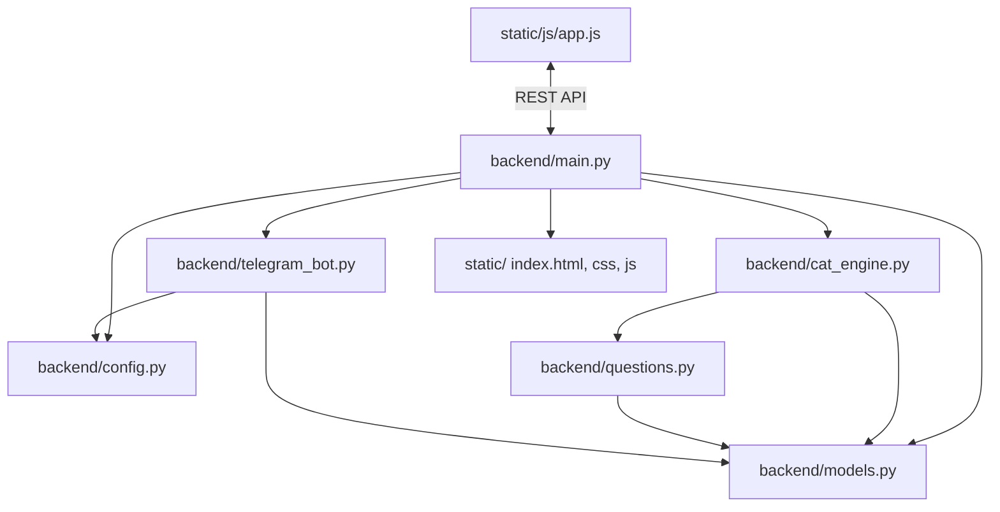

# 🗺️ Карта кодовой базы и граф зависимостей (CODEBASE_MAP.md)

Этот документ помогает новому агенту мгновенно понять, за что отвечает каждый файл и как они связаны между собой.

---

## 🏗️ Граф зависимостей компонентов (Import Graph)

---

## 📁 Таблица ответственности файлов

| Файл | Ответственность | Что содержит | Если меняешь этот файл, проверь: |
|---|---|---|---|
| `backend/main.py` | Веб-сервер и роутинг | FastAPI приложение, lifespan, эндпоинты `/api/test/*`, раздача `/static` | Запуск сервера, работу polling |
| `backend/config.py` | Конфигурация | Чтение `.env` (`BOT_TOKEN`, `ADMIN_CHAT_ID`, `PORT`) | Значения по умолчанию |
| `backend/models.py` | Схемы данных (Pydantic) | `Question`, `ClientQuestion`, `AnswerSubmission`, `TestResult` | **ВНИМАНИЕ:** Влияет на весь бэкенд и фронтенд! Проверь `main.py`, `cat_engine.py`, `app.js` |
| `backend/cat_engine.py` | Логика тестирования | Класс `TestSession`, алгоритм CAT, расчет CEFR и рекомендаций | `test_simulation.py` и `test_e2e.py` |
| `backend/questions.py` | Банк вопросов | Список `QUESTION_BANK` с вопросами A1–C2 | `len(QUESTION_BANK) >= 30`, корректность `correct_option` |
| `backend/telegram_bot.py` | Telegram-бот | Хэндлеры aiogram 3.x, форматирование HTML-карточек | Доставку сообщений в Telegram |
| `static/index.html` | Разметка UI | 3 экрана: `welcome`, `question`, `result`, Telegram SDK | Соответствие ID элементов скрипту `app.js` |
| `static/css/style.css` | Стили | Glassmorphism, переменные палитры `:root`, медиа-запросы | Адаптивность в мобильном окне (<768px) |
| `static/js/app.js` | Клиентская логика | Запросы к API, таймер, клавиатура (A-D), Telegram WebApp | Консоль браузера на отсутствие ошибок |
