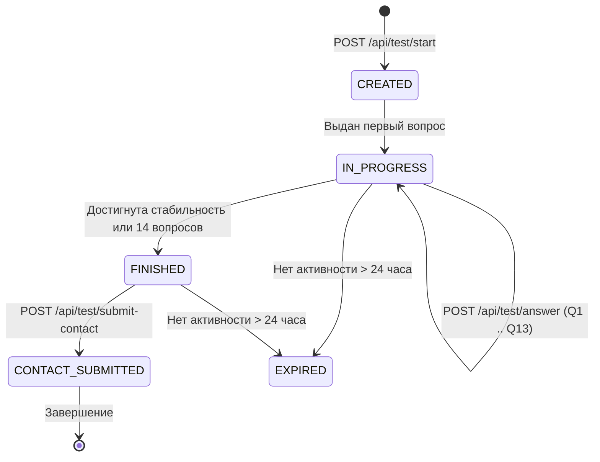

# 🔄 Жизненный цикл сессии тестирования (SESSION_LIFECYCLE.md)

Этот документ описывает состояния сессии тестирования, правила перехода между ними и стратегию очистки памяти.

---

## 1. Диаграмма состояний (State Machine)

---

## 2. Описание состояний:

1. **`CREATED`**: Сессия зарегистрирована в словаре `cat_engine.sessions`, сгенерирован уникальный `UUID4`, стартовый рейтинг `ability = 3.0` (B1).
2. **`IN_PROGRESS`**: Пользователь отвечает на вопросы. На каждом ответе:
   - Обновляется `ability` с учетом серии (streak).
   - Вопрос добавляется в `history` и `asked_question_ids`.
   - Проверяется условие раннего выхода (`should_finish`).
3. **`FINISHED`**: Тест завершен. Формируется неизменяемый объект `TestResult`:
   - Расчет CEFR уровня (A1–C2).
   - Вычисление 0–100 балла и точности.
   - Сводка сильных и слабых навыков.
4. **`CONTACT_SUBMITTED`**: Пользователь отправил свои данные (Имя, Телефон, Telegram). Результаты отосланы администратору и/или ученику, флаг `telegram_sent = True`.
5. **`EXPIRED`**: Сессия старше 24 часов подлежит удалению сборщиком неактивных сессий.
