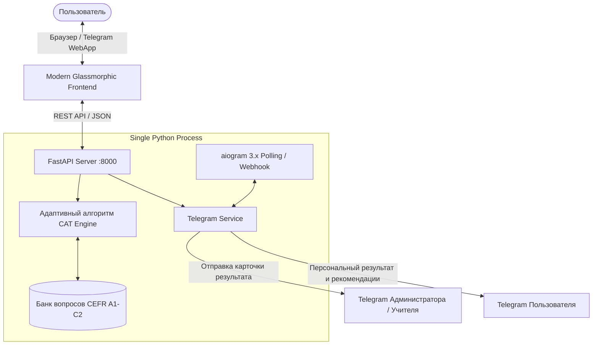

# 📐 Implementation Plan: English Level CAT Platform (TASK-001)

- **ID плана:** PLAN-001
- **Дата создания:** 2026-09-17
- **Статус:** 🟢 ВЫПОЛНЕН И ОДОБРЕН ПОЛЬЗОВАТЕЛЕМ
- **Цель:** Развертывание системы адаптивного тестирования английского языка с единым сервером на Python (FastAPI + aiogram 3.x), веб-интерфейсом и Telegram-ботом.

---

## 🏗️ Архитектурное решение

---

## 📋 Реализованные компоненты:

1. **CAT Engine (`backend/cat_engine.py`)**:
   - Начальный уровень: B1 (способность 3.0).
   - Динамический шаг: `max(0.28, 0.75 * (0.91 ** len(history)))`.
   - Серии верных/неверных ответов (стрейки) увеличивают шаг адаптации.
   - Остановка теста при стабилизации оценок (от 10 до 14 вопросов).
   - Расчет CEFR, баллов 0-100, процентов точности, слабых тем.

2. **Банк вопросов (`backend/questions.py`)**:
   - 30 калиброванных вопросов по шкале CEFR A1–C2.
   - Категории: Grammar, Vocabulary, Usage.

3. **Единый сервер (`backend/main.py`)**:
   - FastAPI + Lifespan для запуска фонового Polling бота на aiogram 3.x.
   - Автоматический fallback в Demo-режим, если токен не указан.

4. **Интерфейс (`static/`)**:
   - `index.html`, `css/style.css`, `js/app.js`.
   - Glassmorphism, тёмная неоновая палитра, таймер, горячие клавиши.

5. **Тестирование**:
   - `test_simulation.py`: симуляция схождений алгоритма.
   - `test_e2e.py`: проверка полного цикла работы API.
